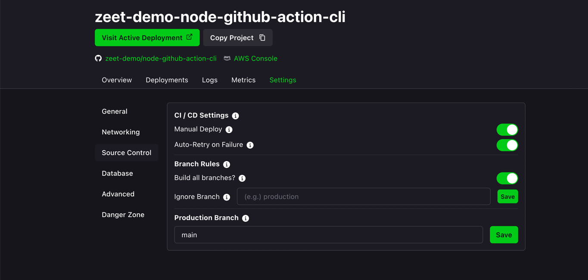

# node-github-action-cli

This repo shows an example Docker Express.js app that is run on Zeet. On every release, through Github Actions, a Docker container 
is built & published, deployed on Zeet to an existing project (with [Deploy Action](https://github.com/zeet-co/zeet-deploy-action)) and then a command is
run on the deployment (with [Run Action](https://github.com/zeet-co/zeet-run-action)). Check out the Actions Workflow [here](https://github.com/zeet-demo/node-github-action-cli/blob/main/.github/workflows/push.yml).

Note: Zeet automatically redeploys code upon a commit by default. This example uses Manual Deploy instead:

